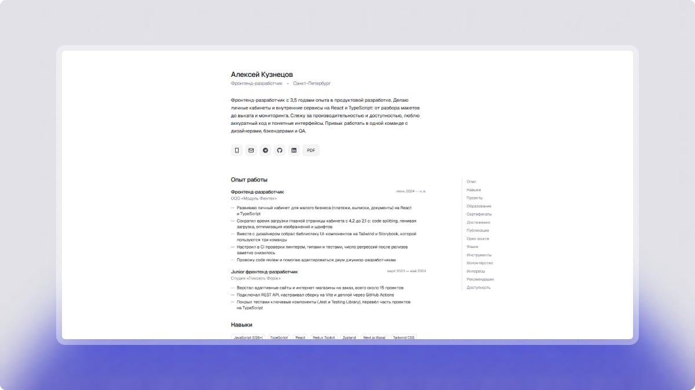

# ProstoCV

Минималистичное резюме-сайт. Вы заполняете один файл, `cv.config.ts`, и страница собирается сама. Она одинаково аккуратно выглядит в браузере и в печати: резюме можно отправить ссылкой или сохранить в PDF.

[Пример](https://kagulion.github.io/prosto-cv/)



## Резюме с помощью ИИ-агента

Самый простой путь: агент задаёт вопросы о вашей карьере, а вы кликаете по вариантам или отвечаете коротко. По ответам он сам заполняет `cv.config.ts`: структурирует текст и подбирает формулировки, понятные рекрутёрам и ATS, но ничего не выдумывает.

1. Нажмите **Use this template** на странице репозитория на GitHub и склонируйте созданную копию.
2. Установите [Node.js](https://nodejs.org) 22.12 или новее. Затем в папке проекта выполните:

   ```bash
   corepack enable
   pnpm install
   ```

3. Откройте папку проекта в ИИ-агенте (Claude Code, Codex, Cursor, Copilot, Gemini CLI и других) и напишите: «составь моё резюме». В Claude Code можно вызвать `/build-cv`.
4. Отвечайте на вопросы. Агент не придумает факты, поэтому цифры и достижения он будет спрашивать у вас.
5. Посмотрите результат:

   ```bash
   pnpm dev
   ```

   Откройте http://127.0.0.1:4321.

Как это устроено: агенты читают `AGENTS.md`, откуда попадают на [инструкцию](.claude/skills/build-cv/SKILL.md).

## Технологии

Astro, TypeScript, Tailwind CSS, шрифты Geist, иконки Lucide. Картинка для превью ссылки рисуется на сборке через satori и resvg.

## Заполнение вручную

Если агента нет под рукой, всё можно сделать самому. Править нужно только `cv.config.ts`, код в `src` трогать не требуется.

### Начало

Нужны Node.js 22.12 или новее и pnpm 11 (`corepack enable` подтянет его сам).

```bash
pnpm install
pnpm dev
```

Откройте http://127.0.0.1:4321. Вы увидите пример: резюме вымышленного Алексея Кузнецова. Замените данные в `cv.config.ts` своими, страница обновляется при сохранении файла.

Когда всё готово:

```bash
pnpm build
```

Готовые файлы лежат в папке `dist`, их можно выложить на любой статический хостинг.

### Главное правило

Секция появляется на странице, только если вы её заполнили. Нет данных или список пуст, значит секции нет вовсе: ни заглушки, ни пустого заголовка. Не нужна секция «Волонтёрство»? Удалите её из конфига.

Обязательны четыре вещи: `name`, `position`, `about` и хотя бы один контакт в `contacts`. Всё остальное по желанию.

### Поля конфига

Лучший справочник это сам `cv.config.ts`: в нём показаны почти все поля, а редактор подсказывает допустимые значения.

| Поле                                         | Что это                                                                       |
| -------------------------------------------- | ----------------------------------------------------------------------------- |
| `lang`                                       | Язык страницы, например `ru` или `en`                                         |
| `name`, `position`                           | Имя и должность в шапке (обязательно)                                         |
| `contacts`                                   | `phone`, `email`, `telegram`, `github`, `linkedin`, `links`, `location`       |
| `about`                                      | Текст о себе (обязательно)                                                    |
| `experience`                                 | Места работы: `position`, `company`, `period`, `bullets`                      |
| `projects`                                   | Проекты: `name`, `description`, `tech`, `url`                                 |
| `skills`, `tools`                            | Списки строк                                                                  |
| `education`                                  | `institution`, `degree`, `field`, `period`                                    |
| `certificates`                               | `title`, `issuer`, `year`                                                     |
| `achievements`, `publications`, `openSource` | Списки: строка или `{ text, url }`, если нужна ссылка                         |
| `languages`                                  | `name`, `level`, `note`                                                       |
| `volunteering`, `interests`                  | Простой текст                                                                 |
| `recommendations`                            | `quote`, `author`, `role`, `company`                                          |
| `availability`                               | `format`, `employment`, `salary`, `start`                                     |
| `seo`                                        | Адрес сайта, описание для поиска, заголовок вкладки, `noindex`                |
| `labels`                                     | Названия секций и другие тексты интерфейса; `pdfButton: false` убирает кнопку |
| `footer`                                     | Футер показывается всегда; `logo: false` убирает логотип, `credit` задаёт alt |

Секции идут на странице в том же порядке, что и в таблице.

### Контакты

Пишите контакты как удобно, ссылки сайт соберёт сам:

- `telegram: 't.me/ivanov_dev'` или `'@ivanov_dev'`
- `github: 'github.com/ivanov-dev'` или просто `'ivanov-dev'`
- `phone: '+7 999 999-99-99'` станет ссылкой `tel:`
- `email` станет ссылкой `mailto:`

Любые другие ссылки (Behance, YouTube, блог) добавляйте в `links`. Каждая ссылка это строка или объект:

```ts
links: [
  'behance.net/ivanov', // иконка Behance подберётся по домену
  { url: 'https://ivanov.dev', label: 'Блог' }, // неизвестный сайт получит иконку «ссылка»
  { url: 'https://example.com/me', icon: 'mastodon' } // иконку можно задать вручную
];
```

- `icon` это имя бренда из [Font Awesome Brands](https://fontawesome.com/search?ic=brands) (`behance`, `youtube`, `x-twitter`) или `link`. Без него иконка определяется по домену.
- `label` это подпись для печати и подсказки. Без неё берётся адрес без `https://`.
- Допустимы только `http` и `https`.

### PDF

Среди контактов есть кнопка «PDF»: она открывает окно печати браузера, где нужно выбрать «Сохранить как PDF». Для печати у страницы отдельная вёрстка: кнопка и навигация скрываются, остаётся только резюме. Кнопку можно убрать через `labels: { pdfButton: false }`, а печать открывается и по Ctrl+P (на Mac Cmd+P).

### Другой язык

Все тексты интерфейса берутся из конфига, поэтому резюме можно вести на любом языке. Поставьте `lang: 'en'` и переименуйте секции в `labels`:

```ts
labels: {
  sections: {
    experience: { title: 'Work experience', nav: 'Experience' }
  }
},
```

`title` это заголовок секции, `nav` это короткое имя в меню (если его нет, берётся `title`).

### Превью ссылки и SEO

Блок `seo` нужен, чтобы ссылка красиво выглядела в мессенджерах и поиске:

```ts
seo: {
  url: 'https://my-name.example.com', // адрес, где будет лежать сайт
  description: 'Фронтенд-разработчик: React, TypeScript',
},
```

С `url` сайт добавляет canonical и собственную картинку превью (`/og.png`) с вашим именем и должностью. `seo.title` и `seo.description` задают заголовок вкладки и описание для поиска, а без них берутся из конфига. Чтобы закрыть страницу от поисковиков, добавьте `noindex: true`.

### Публикация

Workflow `.github/workflows/deploy.yml` при пуше в `main` собирает сайт и выкладывает его на GitHub Pages. Один раз включите в настройках репозитория Pages → Source → GitHub Actions. Сайт откроется по адресу `https://<логин>.github.io/<репозиторий>/`. Укажите этот адрес в `seo.url`.

Для другого хостинга (корень домена) просто выполните `pnpm build` и выложите папку `dist`.

### Если что-то не так

Конфиг проверяется при сборке. При ошибке вы получите понятное сообщение с именем поля, например «нужен хотя бы один контакт» или «неверный адрес электронной почты». Опечатку в имени поля сайт тоже подсветит. Исправьте поле, и сборка пройдёт.

### Команды

| Команда             | Что делает                                    |
| ------------------- | --------------------------------------------- |
| `pnpm dev`          | Сайт локально на 127.0.0.1:4321               |
| `pnpm build`        | Сборка в папку `dist`                         |
| `pnpm preview`      | Посмотреть собранный сайт                     |
| `pnpm check`        | Проверка типов                                |
| `pnpm lint`         | Проверка кода ESLint                          |
| `pnpm format:check` | Проверка форматирования (`pnpm format` чинит) |

## Лицензия

[MIT](LICENSE)
